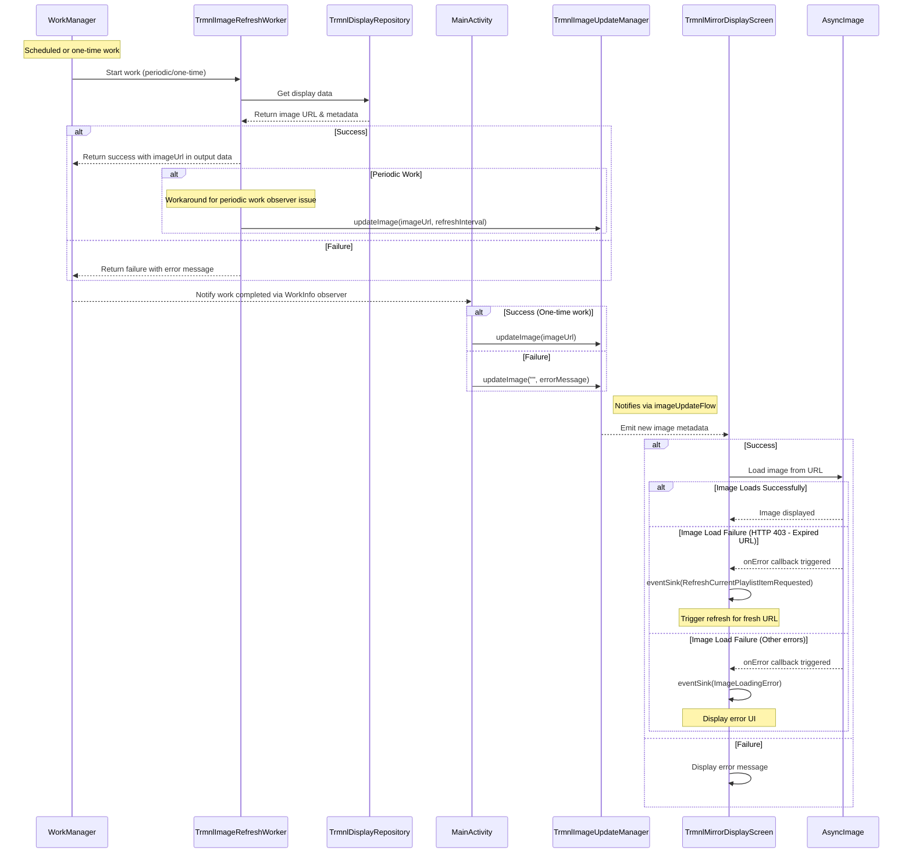

# Contributing Guide

Thank you for your interest in contributing to TRMNL App! This document provides guidelines and instructions to help you contribute effectively.

## Application Overview

This guide will help you get started with the TRMNL Android application development.

<details>

<summary>See technical details on the project</summary>

### Project Structure

The app uses a modern Android architecture with the following components:

- **UI**: Jetpack Compose with Circuit UDF architecture
- **Background Processing**: WorkManager for scheduled image (re)loading
- **Networking**: Retrofit and OkHttp for API communication
- **DI**: Dagger with Anvil for dependency injection
- **Data Storage**: DataStore for preferences and token storage

#### Key Features/Screens

- Main TRMNL visualization in `TrmnlMirrorDisplayScreen`
- Settings management via `AppSettingsScreen`
- Image refresh log/history in `DisplayRefreshLogScreen`
- Background refresh scheduling with `TrmnlWorkScheduler` & `TrmnlImageRefreshWorker`

</details>

## Development Setup

1. Clone the repository
2. Open the project in [Android Studio](https://developer.android.com/studio)
3. Sync Gradle files
4. Connect an Android device or start an emulator and select it
5. Click the Run button (green triangle) in the toolbar

## Code Style and Formatting

We use [ktlint](https://pinterest.github.io/ktlint/latest/) for Kotlin code formatting. Before submitting any changes, run:

```bash
./gradlew formatKotlin
```

This will automatically format your Kotlin code according to project standards.

## Pull Request Process

1. Fork the repository and create your branch from `main`
2. Make your changes
3. Run `./gradlew formatKotlin` to ensure code style compliance
4. Run tests with `./gradlew test`
5. Submit a pull request to the `main` branch

## Testing

Before submitting your changes, please run:

```bash
./gradlew lintKotlin testDebugUnitTest
```

## Building

To build a debug APK:

```bash
./gradlew assembleDebug
```

### Build Types
The app uses standard Android build types (debug and release). There are no product flavors.

**Build Types:**
- **Debug**: Development builds with fake API support and debug keystore
- **Release**: Production builds with code shrinking, ProGuard, and production keystore

To build the release APK:
```bash
# Build the release variant
./gradlew assembleRelease
```

This command builds a single, signed APK that works both locally (with debug keystore fallback) and in CI (with production keystore).

### Release Process

For instructions on creating new releases and managing versions across the project, see the [Release Checklist](RELEASE_CHECKLIST.md).


### Snapshot Builds
Automatic snapshot release builds are available in the [release workflow](https://github.com/usetrmnl/trmnl-android/actions/workflows/android-release.yml) artifacts.


## Issues

- For bug reports, include steps to reproduce, expected behavior, and actual behavior
- For feature requests, describe the feature and why it would be valuable

## Additional Resources

- [Project README](README.md)
- [Android Jetpack Compose](https://developer.android.com/jetpack)
- [Circuit UDF Architecture](https://slackhq.github.io/circuit/)
- [Android Work Manager](https://developer.android.com/topic/libraries/architecture/workmanager)

Thank you for contributing to TRMNL App!


## TRMNL App Image Loading Flow
Here is a generated sequence diagram illustrating the flow of image loading in the TRMNL application.


<details>
<summary>Click to expand the mermaid diagram</summary>



</details>


### 📖 Flow Explanation

1. **WorkManager** initiates the image refresh work (either periodic scheduled work or one-time work)

2. **TrmnlImageRefreshWorker** executes the work:
    - Fetches display data from TrmnlDisplayRepository
    - Adds success/failure log entry
    - Returns result with image URL or error message
    - **For periodic work only**: Directly calls `TrmnlImageUpdateManager.updateImage()` as a workaround for potential WorkInfo observer issues with periodic work

3. **MainActivity** observes the work completion:
    - Receives WorkInfo updates from WorkManager
    - Calls `TrmnlImageUpdateManager.updateImage()` with new image URL (for one-time work) or error message

4. **TrmnlImageUpdateManager** gets notified of new image:
    - Receives updates from either MainActivity (one-time work) or directly from TrmnlImageRefreshWorker (periodic work)
    - Updates the image metadata
    - Emits the update through imageUpdateFlow

5. **TrmnlMirrorDisplayScreen** receives the update:
    - Collects from imageUpdateFlow
    - Updates state with new image URL or error

6. **AsyncImage** loads the image:
    - On success: Displays the image
    - On failure: Triggers onError callback
      - **HTTP 403 (expired URL)**: Automatically triggers a refresh to get a fresh URL
      - **Other errors**: Shows error UI with error message

This data flow uses a combination of WorkManager for background processing, StateFlow for reactive updates, and Compose for UI rendering.
